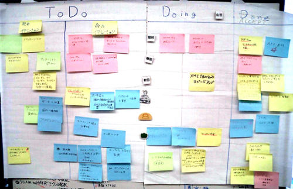
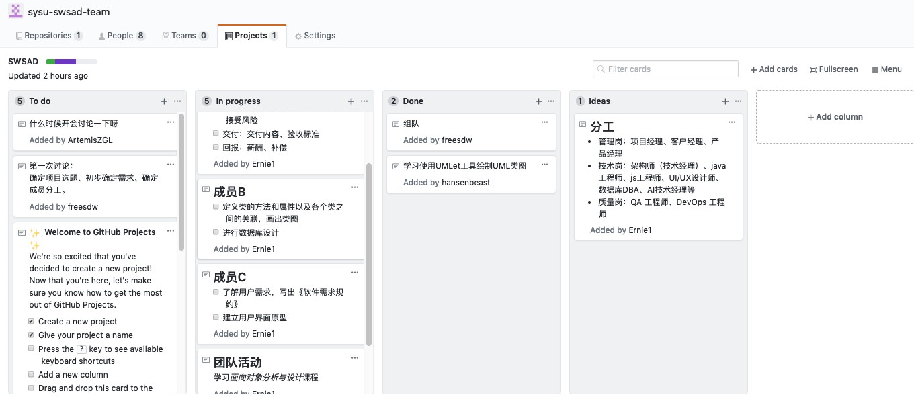
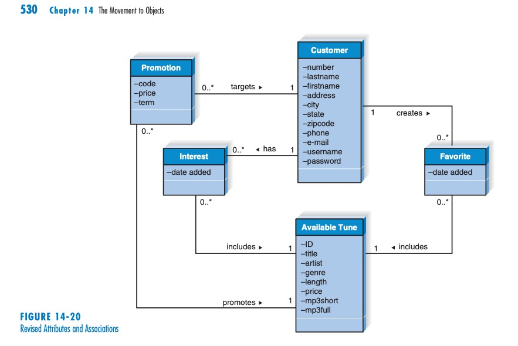
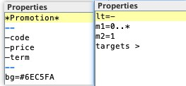

## 一、简答题

### 1. 用简短的语言给出对分析、设计的理解。

- 分析强调对问题的调查研究而非解决方案。在软件生命周期的里程碑中，前两个阶段为**可行性分析与计划阶段**和**需求分析阶段**，要对客户的需求和软件的可行性进行分析，有的放矢。
- 设计强调找出解决方案，把各项需求转换成软件的体系结构。结构中每一组成部分都是意义明确的模块，每个模块都和某些需求相对应。
- 有益的分析和设计可以概括为**做正确的事**和**正确地做事**

例如在使用 UML 时，分析将在需求，用例，活动图中进行，而设计将在类图，序列图，状态图中进行。


### 2. 用一句话描述面向对象的分析与设计的优势。

对现实中的对象进行**结构化，抽象化**。分析者可以不需要专业的编程知识，使得在**问题域**（指被开发系统的应用领域，即在客观世界中由该系统处理的业务范围）的专家和在**实现层**面的专家可以使用通用的符号来进行交流。


### 3. 简述 UML（统一建模语言）的作用。考试考哪些图？

> UML（统一建模语言）：是面向对象的可视化建模语言。
>
> UML 图：是一组用于描述OOAD过程的图形化表达方式。
>
> UML 是数据库设计过程中，在E-R图（实体-联系图）的设计后的进一步建模。

**作用：**

1. UML统一了各种方法对不同类型的系统、不同开发阶段以及不同内部概念的不同观点，从而有效的消除了各种建模语言之间不必要的差异。

2. UML建模能力比其它面向对象建模方法更强。它不仅适合于一般系统的开发，而且对并行、分布式系统的建模尤为适宜。

3. 使用UML使硬件组件和软件组件之间将会有更大的透明度。便携性和综合效率将会增加。

**需求分析人员（BA）**用其可以绘制用例图等，可以用于和业务沟通需求。

**软件设计人员（SA）**可以用其绘制活动图、顺序图、类图等用于做概要设计、详细设计。

**软件开发人员（SE）**也需要知道UML，至少要看懂设计人员的设计文档。

[参考](https://www.jianshu.com/p/a8a4dbda1194)


UML 图一般分为 3 类（[from](https://zh.wikipedia.org/wiki/%E7%BB%9F%E4%B8%80%E5%BB%BA%E6%A8%A1%E8%AF%AD%E8%A8%80#%E5%9B%BE%E5%BD%A2)）


结构性图形（*Structure diagrams*）强调的是系统式的建模：

- 静态图（static diagram）
  - [类图](https://zh.wikipedia.org/wiki/%E7%B1%BB%E5%9B%BE)
  - [对象图](https://zh.wikipedia.org/w/index.php?title=%E5%AF%B9%E8%B1%A1%E5%9B%BE&action=edit&redlink=1)
  - [包图](https://zh.wikipedia.org/w/index.php?title=%E5%8C%85%E5%9B%BE&action=edit&redlink=1)
- 实现图（implementation diagram）
  - [组件图](https://zh.wikipedia.org/wiki/%E7%BB%84%E4%BB%B6%E5%9B%BE)
  - [部署图](https://zh.wikipedia.org/w/index.php?title=%E9%83%A8%E7%BD%B2%E5%9B%BE&action=edit&redlink=1)
- [剖面图](https://zh.wikipedia.org/w/index.php?title=%E5%89%96%E9%9D%A2%E5%9B%BE&action=edit&redlink=1)
- [复合结构图](https://zh.wikipedia.org/wiki/%E5%A4%8D%E5%90%88%E7%BB%93%E6%9E%84%E5%9B%BE)


行为式图形（*Behavior diagrams*）强调系统模型中触发的事件：

- [活动图](https://zh.wikipedia.org/wiki/%E6%B4%BB%E5%8A%A8%E5%9B%BE)
- [状态图](https://zh.wikipedia.org/wiki/%E7%8A%B6%E6%80%81%E5%9B%BE)
- [用例图](https://zh.wikipedia.org/wiki/%E7%94%A8%E4%BE%8B%E5%9B%BE)


交互性图形（*Interaction diagrams*），属于行为图形的子集合，强调系统模型中的资料流程：

- [通信图](https://zh.wikipedia.org/w/index.php?title=%E9%80%9A%E4%BF%A1%E5%9B%BE&action=edit&redlink=1)
- [交互概述图](https://zh.wikipedia.org/wiki/%E4%BA%A4%E4%BA%92%E6%A6%82%E8%BF%B0%E5%9C%96)（UML 2.0）
- [时序图](https://zh.wikipedia.org/wiki/%E6%97%B6%E5%BA%8F%E5%9B%BE)（UML 2.0）
- [时间图](https://zh.wikipedia.org/w/index.php?title=%E6%97%B6%E9%97%B4%E5%9B%BE&action=edit&redlink=1)（UML 2.0）


### 4. 从软件本质的角度，解释软件范围（需求）控制的可行性

[软件的本质](https://www.sebokwiki.org/wiki/The_Nature_of_Software)决定了软件开发的困难，Brook 总结其本质特性为四个：

1. complexity 复杂性
2. conformity 一致性
3. changeability 可变性
4. invisibility 不可视性


项目的首要约束是 **scope, time, quality and budget** 四个基本元素，也称为[项目管理三角模型](https://en.wikipedia.org/wiki/Project_management_triangle)。一个项目合约，即是关于四个元素在 **理论** 上精确的约定。项目管理的任务就是优化调度资源使得这些约束得以满足，且最低的成本。

在实际软件项目中，即使在有明确的软件开发合同条件下，这四个约束并不是不可商量的。原因在于软件生产是易变、不可见、独特的智力生产！因为我们并不能如生产肥皂、衣服一样先给一个样品参考标准，甚至在项目开完成也无法写出完善的软件需求规格说明书。已 word 为例，设计师并不完全知道客户真需要什么，会在哪些场景中使用它，除了等待客户反馈，迭代升级，别无其他的方法。

从提升客户满意度的角度，了解并控制这四个元素就是 **软件项目成功的关键**。

- 工期，软件项目刚性约束。多数情况下，软件的按时投产意味着收益或成本降低
- 预算，软件项目重要约束。它与工期一样，最容易观察与度量，所以没有特别情况也不宜超预算
- 质量，软件质量通常是有底线的。一些指标如可靠性、性能等，比较难以商量；另一些指标如易用性似乎相对灵活，但用户满意度对此特别敏感
- 范围，在多数情况下，客户与开发者能就项目的 20% 内容给出严格的需求约定，80% 的内容都是相对模糊的。因此，围绕客户目标，发现并满足客户感兴趣的内容是最关键的。以 Office 产品为例，早期的版本的功能没有现在版本的 1% ，但这并不会妨碍它的成功。在当年并没人预见到 Office 会有如此多功能，使用者也不会因罗列诸多功能的产品感兴趣，感兴趣的往往是当时背景下最能创造价值的几个特性。

Scope = Time × Resources，在项目管理中称为 STR 模型。

由于软件本身的复杂性、不可见性、不一致性、可变性，软件范围多数情况下对于客户和开发者都是模糊的，这形成软件产品与其他产品不同的开发过程。因此，范围管理是软件项目管理的重中之重！（软件内在本质固然是软件危机的根源，同时也带来开发管理的特色，产品设计与开发者有更大的话语权，这是双刃的！）

软件工程语录：“**先做到，再做好！**”。砍去一些客户都没思考清晰的业务，永远是对的。


## 二、项目管理实践

### 1. 看板使用练习（提交看板执行结果贴图，建议使用 Git project）

- 使用截图工具（png格式输出），展现你团队的任务 Kanban
- 每个人的任务是明确的。必须一周后可以看到具体结果
- 每个人的任务是1-2项
- 至少包含一个团队活动任务


[看板](https://en.wikipedia.org/wiki/Kanban_%28development%29)（kanban）是敏捷开发的重要手段，主要用于项目的进度管理。所有需要完成的任务，都做成卡片，贴在一块白板上面，这就是看板。



按照不同的阶段，看板分成若干列。上图是一种常见的分法，将项目周期分成三列。

- Todo （待开发）
- Doing （开发中）
- Done （已完成）

可以根据实际情况，分出更多的列。

- Todo （待安排）
- Plan （计划）
- Develop （开发）
- Test （测试）
- Deploy （部署）
- Done （已完成）


github project 中的看板中，同样可以把 Issue 从一列拖到另一列，表示从一个阶段进入另一个阶段。

https://github.com/orgs/sysu-swsad-team/projects/1




### 2. UML绘图工具练习（提交贴图，必须使用 UMLet）

- 请在 参考书2 或 教材 中选择一个类图（给出参考书页码图号）


参考书2

> [澳] 麦斯阿塞克 著，马素霞 等译，需求分析与系统设计（原书第3版） [Requirements Analysis and System Design]，机械工业出版社，2009，ISBN：9787111272809
>
>  CHAPTER 14: THE MOVEMENT TO OBJECTS
>
> CLASS DIAGRAM




UMLet [下载](https://www.umlet.com/changes.htm)

打开：

```
java -jar umlet.jar
```

文本区的样式格式有以下几种：

- `**`：两个星号中的内容**加粗**；
- `//`：两个斜杠中的内容**斜体**；
- `__`：两个下划线中的内容**加下划线**；
- `--`：两个减号线表示一个横线；
- `bg`：**背景色**，可以取`red`等颜色名，或者十六进制色，如：`0xffffff`；
- `fg`：**前景色**，取值同背景色，用于指定**文字**和**边框**的颜色。


连线的内容标识方式为：

- `m1=`、`m2=`：多重性关联
- `r1=`、`r2=`：角色名
- `q1=`、`q2=`：限定符


由于在 Unity 3D 课中接触过 UML 类图，其具体用法见[中文教程](https://design-patterns.readthedocs.io/zh_CN/latest/read_uml.html#id2)和[英文教程](https://www.visual-paradigm.com/guide/uml-unified-modeling-language/uml-class-diagram-tutorial/)

使用 UMLet 绘图如下

 




