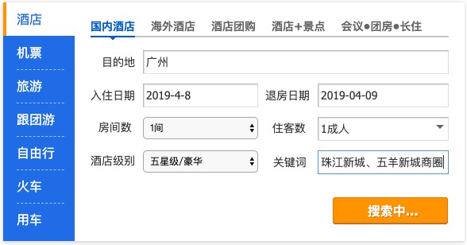

## 一、简答题

### 1. 用例的概念

**用例**（英语：**use case**），或译**使用案例**、**用况**，是软件工程或系统工程中对系统如何反应外界请求的描述，是一种**通过用户的使用场景来获取需求的技术**。（from[百度](https://baike.baidu.com/item/%E7%94%A8%E4%BE%8B/163511)）

通俗地讲，用例是**文本形式的情节描述，** 用以说明某参与者使用系统以实现某些目标。（from《UML和模式应用》 ）

根据我的理解，它是一种**描述系统需求**的方法。而运用用例这种方法来描述系统需求称之为用例建模。用例也是 **UML 规范中的一种标准化的需求表达方式**，其中比较有名的 RUP（Rational Unified Process）就是以用例来驱动的。

编写用例时要避免使用技术术语，而应该用最终用户或者领域专家的语言。用例一般是由软件开发者和最终用户共同创作的。

------

### 2. 用例和场景的关系？什么是主场景或 happy path？

场景

- **场景** (scenario) 是参与者和系统之间的一系列特定的活动和交互，也称为**用例实例** (use case instance)。

- 场景是使用系统的一个特定情节或用例的一条执行路径，即说明了**系统是如何和最终用户或其它系统互动，也就是谁可以用系统做什么**，从而获得一个明确的业务目标。

用例和场景的关系

- 通俗地讲，**用例** (use case)就是**一组相关的成功和失败场景集合**，用来描述参与者如何使用系统来实现其目标。

主场景或 happy path

- **主成功场景（Main Success Scenario）**，也称为**理想路径（happy path）场景或基本流程**，这是用例最基本的组成部分，它描述了**满足涉众关注点的典型成功路径**。要注意的是，**它通常不包括任何条件或分支，这是为了保持连贯性，并且将所有的条件处理都延迟到扩展部分**。这种具有争议的做法更易于理解和扩展。

------

### 3. 用例有哪些形式？

用例能够以不同形式化程度或格式进行编写：

摘要 Brief

- 简洁的一段式概要，通常用于主成功场景。
- 何时使用：在早期需求分析过程中使用，目的是为了快速了解主题和范围。可能只需要几分钟进行编写。

非正式 Casual

- 非正式的段落格式。用几个段落覆盖不同场景。
- 何时使用：同上

详述 Fully

- 详细编写所有步骤及各种变化，同时具有补充部分，如前置条件和成功保证。
- 何时使用：确定并以摘要形式白那些了大量用例后，在第一次需求讨论会中，详细地编写其中少量（例如10%）的具有重要架构意义和高价值的用例。

------

### 4. 对于复杂业务，为什么编制完整用例非常难？

复杂业务的需求多，导致扩展部分较多，即除了主成功场景外的其他场景或分支，包括成功和失败路径。

而在整个用例编写过程当中，理想路径与扩展场景相结合也只能尽可能满足“几乎”所有涉众所关注的问题，因为有些问题最好是作为非功能性需求在补充规格说明中描述，而不是直接在用例中说明。

因此由于业务的复杂性，用例的增加也只能覆盖大部分已出现的情形，而无法完全覆盖所有情景，也就“不完整”。同时，用例可能会遗漏一些关键信息或包含错误的陈述。

------

### 5. 什么是用例图？

用例图是一种优秀的系统**语境图（context diagram）**，用例图可以：

- 展示系统边界、位于边界之外的事物
- 展示系统如何被使用
- 作为沟通的工具，用以概括系统及其参与者的行为

------

### 6. 用例图的基本符号与元素？

基本符号：

元素组成：

1. 系统（System）：图中的大方框，可以是小型软件组件，也可以是完整的应用程序，里面包含外部可见的功能。
2. 参与者（Actor）：系统的左侧外的人形图案，表示与系统或程序进行交互的用户、组织或外部系统。
3. 用例（Use Case）：系统内的椭圆，外部可用的系统功能，对系统提供的服务进行描述。
4. 关系（relation）：用例图中涉及到的关系包括关联、泛化、包含、扩展。

- 关联（Association）：说明了参与者与用例之间的通信，任何一方都可以发送或接受信息，箭头指向的是消息的接收方。
- 泛化（Inheritance）：继承关系。
- 包含（Include）：包含关系用来把一个较复杂用例所表示的功能分解成较小的步骤，箭头指向分解出来的功能用例，旁边需要显式写出该关系为 <<include>>
- 扩展（Extend）：扩展关系是指当前用例功能的延伸，相当于给当前基础样例提供附加的功能。箭头指向原来的基础样例，旁边需要显式写出该关系为 <<extend>>

符号如下：

------

### 7. 用例图的画法与步骤

1. 系统框放在中间，系统名写在上方正中间。
2. 确定参与者，包括:
   - 主要参与者：谁将使用系统的主要功能、谁将需要系统的支持以完成工作等
   - 协作参与者：谁将提供对应的系统功能、谁将维护系统，保证系统处于工作状态等
   - 幕后参与者：谁会对系统产生的结果感兴趣
3. 确定参与者之间的关系（是否为泛化关系）。
4. 根据需求识别和创作用例。
5. 确认用例间的关系（是否为包括或扩展关系）。
6. 确认用例与参与者之间的关系（是否为关联关系）。
7. 在用例的事件流中逐渐发现其他的外部支持系统，放置在系统框的右边。

------

### 8. 用例图给利益相关人与开发者的价值有哪些？

对于利益相关人来说：

- 可以直观看到系统的结果和用户的功能体验，保证系统按照用户的需求进行设计。
- 用例能够根据需要对复杂程度和形式化程序进行增减调节，即能够响应用户（利益相关人)提出的需求，而用例图则使得这种调节更加便利，可以通过修改图形间的关系实现。

对于开发者来说：

- 用例图是设计者设计过程的结论与参考，设计者与开发者之间的交流工具，开发者开发过程的蓝图。
- 用例图使得开发者能够更明确地获得需求，更好地理解需求。
- 用例图可以指导开发和测试，同时可以在整个过程中对其他工作流起到指导作用。

------

## 二、建模练习题（用例模型）

### 1. 选择2-3个你熟悉的类似业务的在线服务系统（或移动 APP），如定旅馆（携程、去哪儿等）、定电影票、背单词APP等，分别绘制它们用例图。并满足以下要求：

- 请使用用户的视角，描述用户目标或系统提供的服务
- 粒度达到子用例级别，并用 include 和 exclude 关联它们
- 请用色彩标注出你认为创新（区别于竞争对手的）用例或子用例
- 尽可能识别外部系统和服务

选择携程网上的国内旅馆预订服务系统

### 2. 然后，回答下列问题：

1. 为什么相似系统的用例图是相似的？

   在相似的系统中，用户需求相似的，即不同的同类系统具有一致的基本功能以及带有特点的其他扩展功能。

   ------

   

2. 如果是定旅馆业务，请对比 Asg_RH 用例图，简述如何利用不同时代、不同地区产品的用例图，展现、突出创新业务和技术

   对比 Asg_RH 用例图，发现携程网提供的服务更为全面，因此它的用例也更多。

   通过利用这两个不同时代、不同地区产品的用例图进行对比发现，可以从以下几个方面考虑业务和技术的创新：

   - 简化用户操作流程：通过分析当前相关的系统的通病，能否把用户交互的流程进一步删减，使得用户能够更快地看到他想要的东西。例如说携程网的过滤排序器比 Asg_RH 更加完善，多考虑了一些重要的 criteria （如酒店级别等）；另外引入了第三方的地图系统，给用户对于酒店位置的了解带来一个非常直观快捷的体验。
   - 通过活动吸引顾客：考虑如何把现有的资源更好地组织起来吸引客户。如不定期地提供各种优惠活动或者优惠组合，方便用户选择更好的方案。例如携程相对于 Asg_RH 就提供了不同的优惠组合，相比起来携程的花费更加划算，比 Asg_RH 更好地吸引用户。
   - 用户反馈：前期通过调研目标用户群，了解到同类系统的不足的地方，在项目初期就需要避免这些问题再次出现。如携程在查看酒店信息详情的时候可以查询其他用户的评论查询，通过建立起一个良好的评论系统，充分发挥用户的参与性，提高系统的可信度。
   - 尽可能提供更多的解决方案：不同用户之间个人情况不尽相同，在项目开发初期就应该确定开发的系统能够提供更多的解决方案，以适应不同的用户需求。例如在支付方式的选择上，携程支持多种在线支付平台，甚至提供了到店再进行支付的服务，这样做可以最大限度保证使用携程的用户最终可以成功预定酒店。反观 Asg_RH, 只提供了信用卡在线付费的方案，这样做无疑会流失一大批不常用信用卡的用户。

   ------

   

3. 如何利用用例图定位创新思路（业务创新、或技术创新、或商业模式创新）在系统中的作用

   对于关于不同方面的创新的用例，使用不同颜色背景的用例图表示，直观地观察其在系统中的作用。

   ------

   

4. 请使用 SCRUM 方法，选择一个用例图，编制某定旅馆开发的需求（backlog）开发计划表

   **Product Backlog** 是 Scrum 的核心，也是一切的起源。从根本上说，它就是一个需求、或故事、或特性等组成的列表，按照重要性的级别进行了排序。它里面包含的是客户想要的东西，并用客户的术语加以描述。我们叫它故事（**Story**），有时候也叫做 Backlog 条目。 一般包括以下字段： 

   - **ID**：统一标识符，就是个自增长的数字而已。以防重命名故事以后找不到它们。 

   - **Name（名称）**：简短的、描述性的故事名。比如“查看你自己的交易明细”。它必须要含义明确，这样开发人员和产品负责人才能大致明白我们说的是什么东西，跟其他故事区分开。它一般由2到10个字组成。 

   - **Importance（重要性）**：产品负责人评出一个数值，指示这个故事有多重要。例如10或150。分数越高越重要。 

   - **Initial Estimate（初始估算）**：团队的初步估算，表示与其他故事相比，完成该故事所需的工作量。最小的单位是故事点（story point），一般大致相当于一个“一个人一天理想的工作量（man-day）”。

   - **How to demo（如何做演示）**：它大略描述了这个故事应该如何在 sprint 演示上进行示范，本质就是一个简单的测试规范。“先这样做，然后那样做，就应该得到……的结果”。 

     

   | ID   | Name     | Imp  | Est  | How to demo                                                  | Notes                                                        |
   | ---- | -------- | ---- | ---- | ------------------------------------------------------------ | ------------------------------------------------------------ |
   | 1    | 查找酒店 | 90   | 20   | 用户在搜索界面中输入目的地/酒店名称、入住日期、退房日期、星级等信息，点击确定后可以根据输入信息生成一个酒店列表。 | 文本输入框可以给出提示信息；时间输入框可以默认先赋值为当前时间日期，节约顾客时间；需要调用GPS第三方系统来确认用户的当前位置以及酒店位置信息。 |
   | 2    | 预订酒店 | 100  | 25   | 用户选择酒店后，可以对入住信息做进一步修改，然后确定入住者信息。 | 使用优秀的筛选过滤算法实现综合的排序功能。                   |
   | 3    | 支付订单 | 70   | 15   | 用户选择自己喜欢的方式进行支付。                             | 可以调用第三方支付API来实现。注意订单生成的正确性以及支付的安全性保证。 |
   | 4    | 用户评价 | 60   | 18   | 用户在结束住房后在评论区写下评价，并给酒店打分。             | 结束住房后可以通过短信等方式提醒用户留下宝贵的建议；注意评价者的隐私性。 |

   ------

   

5. 根据任务4，参考 [使用用例点估算软件成本](https://www.ibm.com/developerworks/cn/rational/edge/09/mar09/collaris_dekker/index.html)，给出项目用例点的估算

   | 用例     | #业务 | #计算 | 原因 | UC 比重 |
   | -------- | ----- | ----- | ---- | ------- |
   | 查找酒店 | 3     | 2     |      | 简单    |
   | 预订酒店 | 6     | 4     |      | 平均    |
   | 支付订单 | 1     | 1     |      | 简单    |
   | 用户评价 | 2     | 1     |      | 简单    |

